# Welcome to my SOCIAL NETWORK API!

## Description

#### This SOCIAL NETWORK API allows users to share their thoughts, react to friends' thoughts, and create a friend list. This app uses Express.js for routing, a MongoDB database, and the Mongoose ODM. 

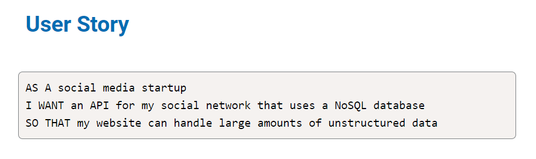

## Table of Contents
* [Installation](#installation)
* [Usage](#usage)
* [Walkthrough](#walkthrough)
* [License](#license)
* [Contributor](#contributor)

## Installation
In order to install this repository, you will need to clone it and run npm init and npm install to install all of the dependencies listed inside the package.json file. 

## Usage
To use this app after cloning and initializing the dependencies, run npm start in the terminal to start the app. You will then see the confirmation that the port is listening.

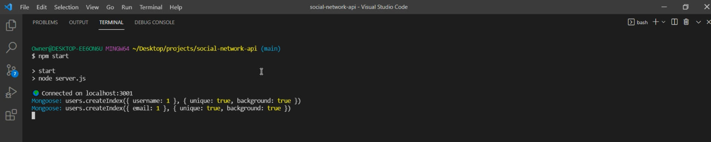

When you open the port in the browser, it is recommended to open Insomnia to test and run the routes. This demo starts with getting all the users.

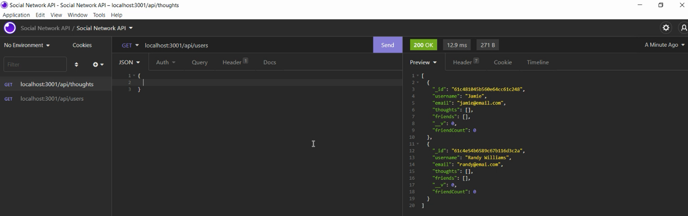

You can also get one user by ID.

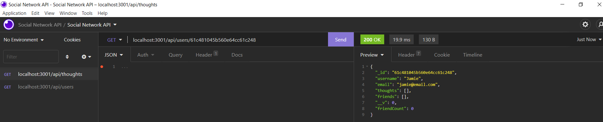

You can run a post route to create a new user.

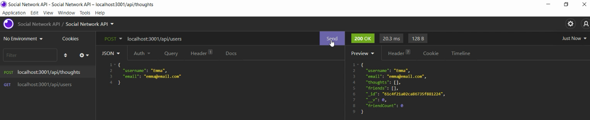

You can run a put route to revise a user.

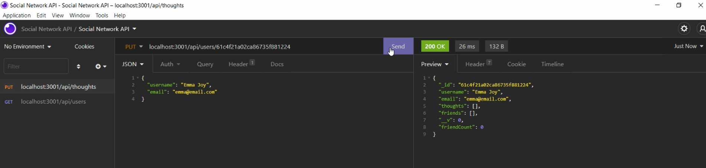

You can confirm the revised users when you get all users again.

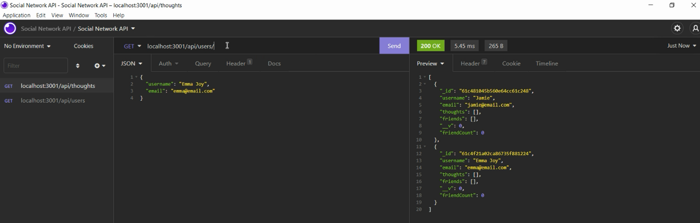

You can delete a user by ID.

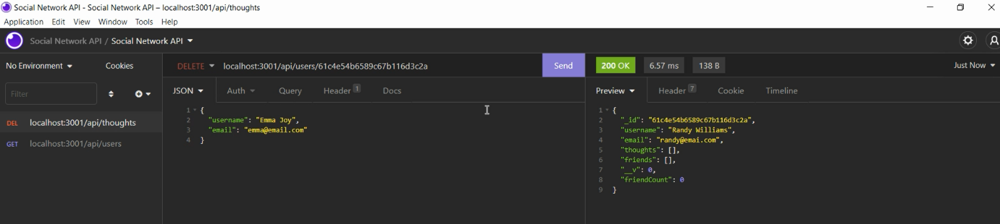

You can get all thoughts.

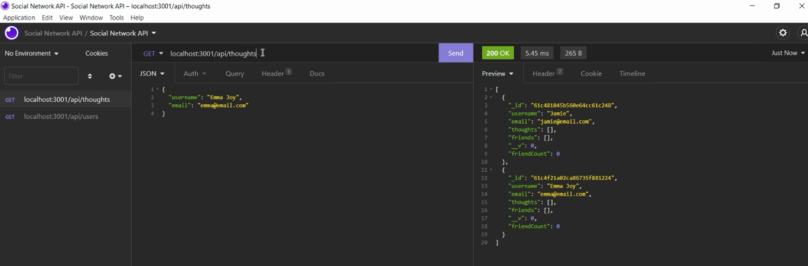

You can also get one thought by ID.

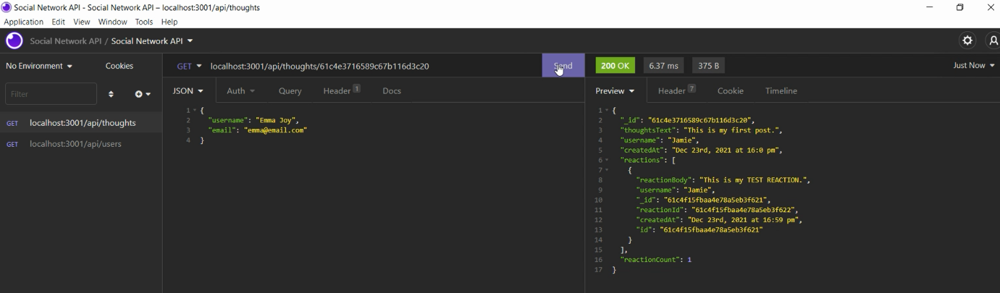

You can run a post route to create a new thought. 

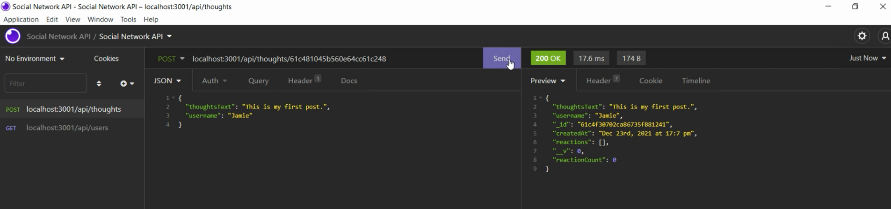

You can run a put route to revise a thought.

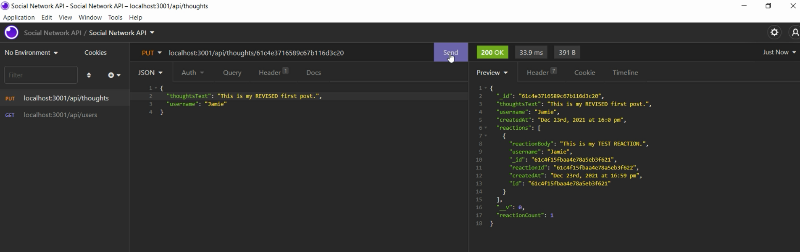

You can delete a thought by ID.

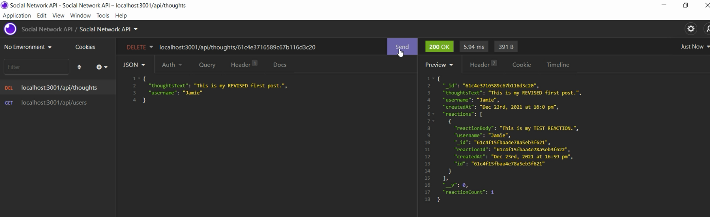

You can add a reaction to a thought.

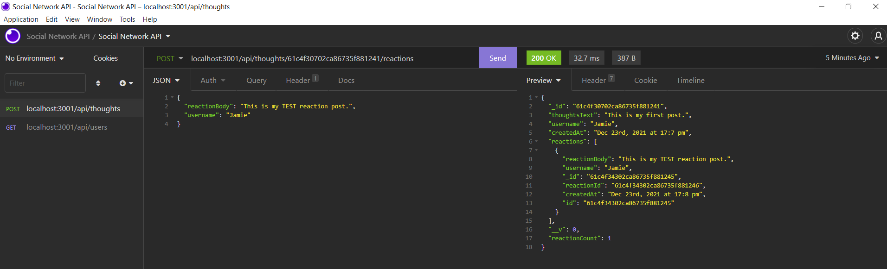

You will see the reaction when you pull up the thought by ID.

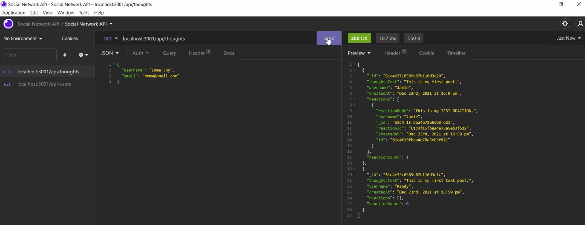

## Walkthrough
Click here for a video walkthrough of my app.
https://watch.screencastify.com/v/2DKAjabrd7H19D3ZiyDJ

### I hope you enjoy using my SOCIAL NETWORK API! I welcome all contributions and feedback!

## License
The license for this project is the MIT.

Copyright © 2021

## Contributor
*If you have any questions, please reach out to me.*

### _Jamie Williams_ 

Jamie's GitHub: [@jamwil1226](https://github.com/jamwil1226/)